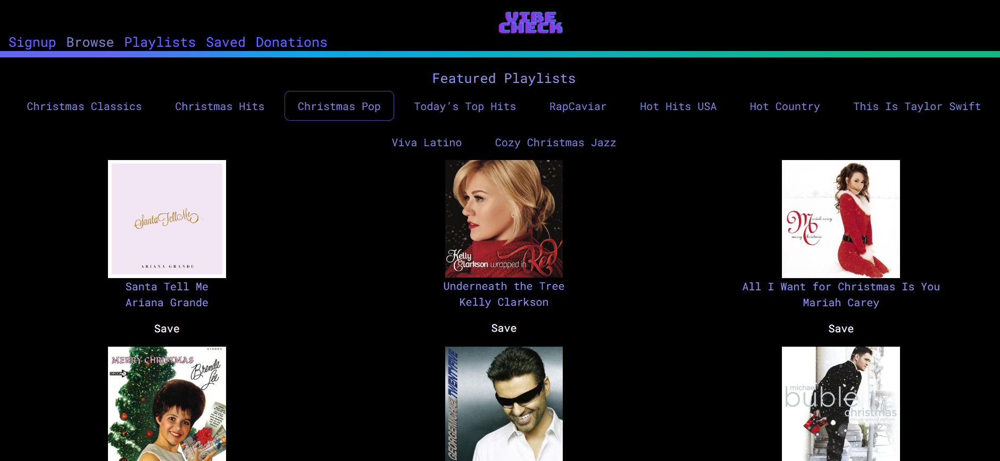

# vibe-check

 

## Links

<ul>
<li> <a href = "https://github.com/patrickodea/Vibe-Check">GitHub Repository</a> </li>
<li> <a href = "https://vibe-check.up.railway.app/">Deployed Link</a> </li>
</ul>

## Description

	What’s more popular than music? Not much. We wanted to focus our project around something that could realistically be useful and frequently used by everyday people. Trying to find new music or a new playlist is a common thing that people do. I see all the time on social media users asking others from music recs.
	Spotify already has playlists that you can find on their app, but they don’t have a spot where a user can actually input what genre they want and pick from multiple, descriptive playlists within that genre.
	This is the problem that Vibe Check solves.

## Table of Contents

- [vibe-check](#vibe-check)
  - [Links](#links)
  - [Description](#description)
  - [Table of Contents](#table-of-contents)
  - [Installation](#installation)
  - [Usage](#usage)
  - [License](#license)
  - [Contributions](#contributions)
  - [Tests](#tests)
  - [Questions](#questions)

## Installation

No installation required.

## Usage

As a hip gen z, I want to be able to find different playlists in different genres to suit different moods.
With my Spotify account, I want to be able to answer a couple questions and receive a whole, new playlist to browse.

## License

MIT

## Contributions

Patrick O'Dea, Cat Corbin, Dae'stanii Spackman, Noah Burton

## Tests

Test using deployed link

## Questions
<ul>
<li> <a href = "https://github.com/CatCorbin">Cat Corbin</a>
</li>
<li> <a href = "https://github.com/NoahAaronBurton">Noah Burton</a>
</li>
<li>
<a href = "https://github.com/daestanii1997">Dae'stanii Spackman</a>
</li>
<li>
<a href = "https://github.com/patrickodea">Patrick O'Dea</a>
</li>